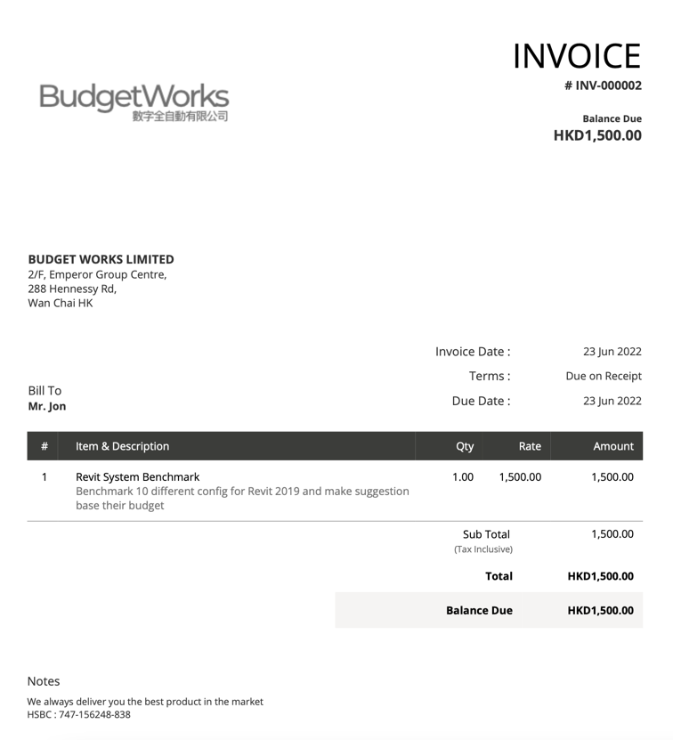
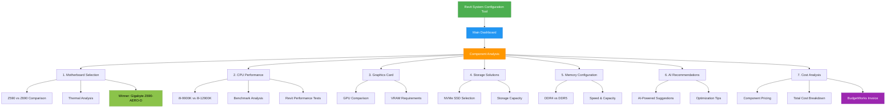
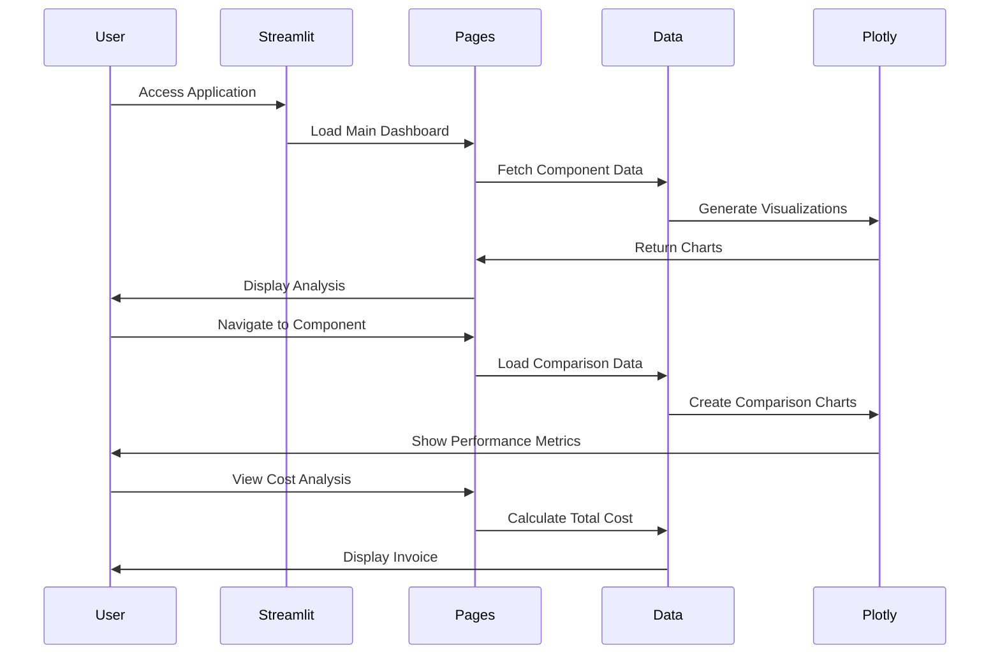
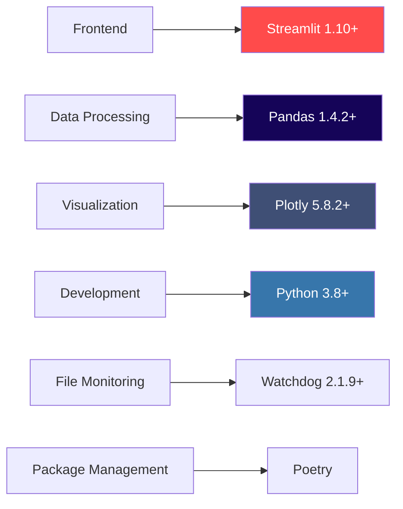

# Revit System Configuration 2022

<div align="center">



**Professional Revit Workstation Specification & Cost Analysis Tool**

Specialized on Operation Apps and Work Automation

[](https://www.python.org/)
[](https://streamlit.io/)
[](LICENSE)

</div>

---

## 📋 Project Overview

This project provides a comprehensive hardware specification analysis and recommendation system for **Autodesk Revit 2022 workstations**. Developed for **Sensis Innovation Ltd** to support the proposed redevelopment of Merry Terrance at 4A-AP Seymoure Road, Hong Kong.

### Project Details
- **Client:** Sensis Innovation Ltd
- **Project:** Proposed Redevelopment of Merry Terrance
- **Location:** 4A-AP Seymoure Road, Hong Kong
- **Date:** June 23, 2022
- **Contact:** [victor@budgetapp.works](mailto:victor@budgetapp.works)

---

## 🎯 Project Constraints & Requirements

### Budget & Performance Requirements
- **Budget:** $40,000 HKD
- **Performance:** Validated against industry benchmarks
- **CPU:** Latest generation Intel CPU with highest clock rate for Revit 2019 & Beyond
- **Memory:** 64GB high-speed RAM for model creation
- **Graphics:** Above-average graphics card with 10GB+ VRAM for Revit 2019
- **Storage:** At least 2TB NVMe SSD
- **Motherboard:** Designer-class motherboard supporting high workloads

### Official Requirements
Based on [Autodesk Revit 2022 System Requirements](https://knowledge.autodesk.com/support/revit/learn-explore/caas/sfdcarticles/sfdcarticles/System-requirements-for-Autodesk-Revit-2022-products.html)

### BIM Workstation Reference (CITF Standard)

| Component    | Specification                                     |
|--------------|---------------------------------------------------|
| CPU          | Intel® Core™ i9 9900k                            |
| Memory       | 32GB RAM DDR4 2666+ or more                      |
| Display Card | NVIDIA Quadro RTX4000 or faster                  |
| Hard Drive   | 500+GB SSD & Min. 2TB 7200+RPM storage           |
| Network      | Gigabit Ethernet Adapter with internet connection|

---

## 🏗️ System Architecture



### Application Flow



### Technology Stack



---

## 🚀 Setup & Installation

### Prerequisites
- Python 3.8 or higher
- Poetry (recommended) or pip
- Node.js (for package.json scripts)

### Installation Steps

#### 1. Clone the Repository
```bash
git clone <repository-url>
cd revit_system_john_2022
```

#### 2. Install Dependencies with Poetry (Recommended)
```bash
# Install Poetry if not already installed
curl -sSL https://install.python-poetry.org | python3 -

# Install project dependencies
poetry install

# Activate virtual environment
poetry shell
```

#### 3. Alternative: Install with pip
```bash
# Create virtual environment
python -m venv venv

# Activate virtual environment
# On Windows:
venv\Scripts\activate
# On macOS/Linux:
source venv/bin/activate

# Install dependencies
pip install streamlit pandas plotly watchdog
```

#### 4. Run the Application
```bash
# Using npm script
npm run dev

# Or directly with Streamlit
streamlit run main.py

# Or with Poetry
poetry run streamlit run main.py
```

The application will open in your default browser at `http://localhost:8501`

---

## 📁 Project Structure

```
revit_system_john_2022/
│
├── main.py                 # Main application entry point
├── pages/                  # Streamlit pages (multi-page app)
│   ├── 1_Motherboard.py   # Motherboard analysis & comparison
│   ├── 2_Cpu.py           # CPU benchmarks & performance
│   ├── 3_Graphic_card.py  # Graphics card specifications
│   ├── 4_Harddisk.py      # Storage solutions
│   ├── 5_Memory.py        # RAM configuration
│   ├── 6_Suggestion.py    # AI-powered recommendations
│   └── 7_Cost.py          # Cost breakdown & invoices
│
├── image/                  # Assets and images
│   ├── budgetwork_invoice.png
│   ├── img.png
│   └── revit_cost.jpeg
│
├── tests/                  # Test suites
│   ├── features/          # BDD feature files
│   ├── step_defs/         # Pytest-BDD step definitions
│   └── e2e/               # Playwright E2E tests
│
├── pyproject.toml         # Poetry configuration
├── package.json           # NPM scripts and metadata
├── poetry.lock            # Dependency lock file
└── README.md              # This file
```

---

## 🧪 Testing

### Unit & Integration Tests (pytest-bdd)

Run BDD tests with pytest:
```bash
# Run all tests
pytest

# Run with coverage
pytest --cov=. --cov-report=html

# Run specific feature
pytest tests/features/motherboard.feature
```

### End-to-End Tests (Playwright)

Run E2E tests:
```bash
# Install Playwright browsers (first time only)
playwright install

# Run E2E tests
pytest tests/e2e/

# Run with UI mode
pytest tests/e2e/ --headed

# Run specific browser
pytest tests/e2e/ --browser chromium
```

---

## 📊 Features

### 1. **Motherboard Analysis**
- Compare Z590 vs Z690 chipsets
- Data bandwidth, RAM speed, and network speed comparison
- Thermal technology assessment
- Recommendation: **Gigabyte Z690-AERO-D-rev-1x**

### 2. **CPU Performance Benchmarks**
- i9-9900K vs i9-12900K comparison
- Multiple benchmark results:
  - Cinebench R23 (Single & Multi-Core)
  - Geekbench 5
  - Revit-specific benchmarks
- 30% performance improvement with i9-12900K

### 3. **Graphics Card Specifications**
- VRAM requirements for Revit 2022
- Performance comparison charts
- Professional GPU recommendations

### 4. **Storage Solutions**
- NVMe SSD vs traditional storage
- Capacity and speed analysis
- Cost-per-GB calculations

### 5. **Memory Configuration**
- DDR4 vs DDR5 comparison
- Speed and capacity recommendations
- 64GB high-speed configuration

### 6. **AI-Powered Suggestions**
- Automated recommendations based on constraints
- Performance optimization tips
- Future-proofing advice

### 7. **Cost Analysis**
- Detailed component pricing
- Total system cost breakdown
- BudgetWorks service invoice
- Budget compliance verification

---

## 📈 Performance Metrics

### CPU Benchmark Comparison (i9-12900K vs i9-9900K)

| Benchmark                        | i9-9900K | i9-12900K | Improvement |
|----------------------------------|----------|-----------|-------------|
| Cinebench R23 (Single)           | 1,284    | 1,997     | +55.5%      |
| Cinebench R23 (Multi-Core)       | 12,450   | 27,472    | +120.7%     |
| Geekbench 5 (Multi-Core)         | 8,779    | 17,595    | +100.4%     |
| Revit 2019.1.1 Benchmark         | 5,651    | 6,946     | +22.9%      |

### Motherboard Comparison (Z590 vs Z690)

| Feature                  | Z590 | Z690  | Improvement |
|--------------------------|------|-------|-------------|
| Data Bandwidth (GT/s)    | 16   | 32    | +100%       |
| Max RAM Speed (MHz)      | 320  | 480   | +50%        |
| Network Speed (Gbps)     | 10   | 100   | +900%       |

---

## 💼 BudgetWorks Services

**By BudgetWorks**
Specialized in Operation Apps and Work Automation

### Contact Information
- **Email:** [victor@budgetapp.works](mailto:victor@budgetapp.works)
- **Project Date:** June 23, 2022

### Services Provided
- Hardware specification analysis
- Performance benchmark testing
- Cost optimization
- System configuration recommendations
- Technical documentation

---

## 🛠️ Technologies Used

- **Python 3.8+** - Core programming language
- **Streamlit 1.10+** - Interactive web application framework
- **Pandas 1.4.2+** - Data manipulation and analysis
- **Plotly 5.8.2+** - Interactive visualizations
- **Watchdog 2.1.9+** - File system monitoring
- **Poetry** - Dependency management
- **Pytest-BDD** - Behavior-driven development testing
- **Playwright** - End-to-end testing framework

---

## 📝 Development

### Adding New Components
1. Create a new page in `pages/` directory
2. Follow naming convention: `N_Component_Name.py`
3. Import required libraries (streamlit, pandas, plotly)
4. Add comparison charts and recommendations

### Running in Development Mode
```bash
# With auto-reload
streamlit run main.py --server.runOnSave true
```

### Code Quality
```bash
# Format code
black .

# Lint code
flake8 .

# Type checking
mypy .
```

---

## 📄 License

This project is licensed under the ISC License.

---

## 🤝 Contributing

Contributions are welcome! Please feel free to submit a Pull Request.

---

## 📞 Support & Contact

For questions, support, or inquiries:

**Victor**
Email: [victor@budgetapp.works](mailto:victor@budgetapp.works)

---

## 🔗 References

- [Autodesk Revit 2022 System Requirements](https://knowledge.autodesk.com/support/revit/learn-explore/caas/sfdcarticles/sfdcarticles/System-requirements-for-Autodesk-Revit-2022-products.html)
- [BIM Workstation Standards (CITF)](https://www.citf.org.hk/)
- [Streamlit Documentation](https://docs.streamlit.io/)
- [Plotly Documentation](https://plotly.com/python/)

---

<div align="center">

**Made with ❤️ by BudgetWorks**

*Specialized in Operation Apps and Work Automation*

</div>
